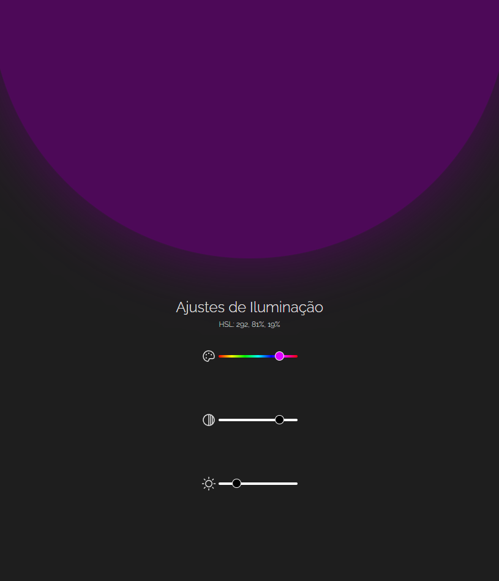
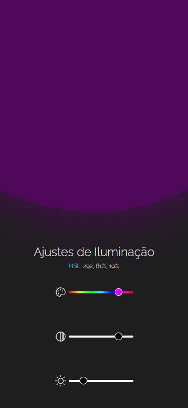

# Ajustes de Iluminação - boraCodar #24

## Layout do desafio

Disponibilizado pela Rocketseat no [Figma](https://www.figma.com/community/file/1250810959627241982).

## Como testar?

```bash
    > git clone https://github.com/volinha/desafio-24-ajustes-de-iluminacao
    > cd desafio-24-ajustes-de-iluminacao
    > pnpm install
    > pnpm dev
```

Acesse `http://localhost:5173` no seu navegador.

## O que é?

São 3 sliders que controlam os valores HSL (Hue, Saturation, Lightness) da cor e mostrados em tempo real no componente superior.

## Screenshots

### Desktop
<p align="center" style="display: flex; align-items: flex-start; justify-content: center;">
  
</p>

### Mobile
<p align="center" style="display: flex; align-items: flex-start; justify-content: center;">
  
</p>

## Principais Tecnologias

- [React](https://react.dev)
- [Vite](https://vitejs.dev)
- [TailwindCSS](https://tailwindcss.com)
- [Visual Studio Code](https://code.visualstudio.com)

#

#### 💻 Desenvolvido com 💖 por Vinícius Fernandes
[](https://www.facebook.com/viniciusfvb)
[](https://www.linkedin.com/in/viniciusfernandesdev/)
[](https://twitter.com/volafernandes)
<a href = "mailto:viniciusfernandesdev@gmail.com"></a>
<br />